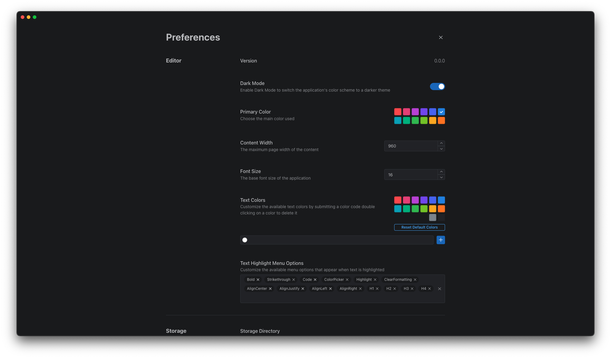

# Notes

<div align="center">
  
</div>

<p align="center">Single Page Note App</p>
<p align="center">Anims to export small document into single page PDF</p>
<p align="center">:warning: Working In Progress</p>




## Development

```
pnpm install
npm run dev
```

## Build and Release

1. Upgrade the version number of all `package.json`
   ```sh
   # sh scripts/version.sh [<newversion> | major | minor | patch | premajor | preminor | prepatch | prerelease | from-git]
   sh scripts/version.sh patch
   ```
2. Run the command below and check `/release`

   ```sh
   npm run package
   ```

   For other platforms, please check [electron-builder](https://www.electron.build/index.html) for more details

## TODO:

- [x] Saving file
- [ ] Code Block
  - [x] Basic Setup
  - [ ] Bubble menu for configure title, line-highlights
  - [ ] Inside list item
  - [ ] Drag handler
- [x] Task List
- [x] Table
- [ ] Image
  - [x] Resizeable
  - [x] Drop to Upload
  - [ ] Review drop to upload
  - [ ] Upload from url
  - [ ] Check Markdown patterns
  - [ ] Alignment, Flot, Center, Inline
- [x] Highlight text -> Bubble Menu
- [x] Export PDF
  - [ ] Remove Extra Spacing
- [ ] Context menu
  - [ ] all actions Spotlight
- [x] Spotlight
- [ ] Export static HTML
- [ ] Table of content on the right hand side
- [x] Prefernces
- [ ] Documentation
  - [x] Features
  - [ ] Shortcuts
- [x] Admonition
- [ ] Git Sync
- [ ] Review Delete
- [ ] Nested List Item
- [ ] Admonition UI
- [ ] Seperate data json into html
- [ ] Directory name should include title
